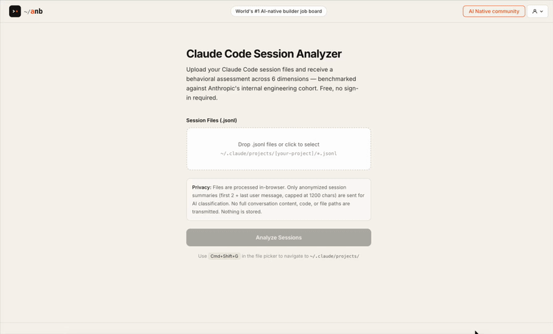

# Claude Code Session Analyzer

A single-file web app that analyzes Claude Code session transcripts and produces a behavioral assessment across 6 dimensions — benchmarked against Anthropic's internal engineering cohort.

**[Try it live →](https://www.ai-native-builder.com/analyze/claude-code)**



---

## What it produces

Upload your `.jsonl` session files, enter an API key, and receive a structured report:

- **Overall AI Coding Maturity score** (1–10) with maturity label
- **6 dimension scores** visualized as a radar chart
- **Task type distribution** across all sessions
- **Complexity progression** over time
- **3 strengths + 3 gaps** with specific recommendations
- **Benchmark comparison** vs Anthropic's Feb 2025 baseline and Aug 2025 best practice

---

## How to use (local)

> **Note:** You must serve the file over HTTP — opening `index.html` directly (`file://`) causes browsers to block API requests.
>
> **Recommended (supports all providers including Claude):**
> ```bash
> python3 server.py
> ```
> This serves the app and proxies Anthropic API calls locally to work around browser CORS restrictions.
>
> **Gemini / OpenAI only** (simpler, no proxy needed):
> ```bash
> python3 -m http.server 8080 --bind 127.0.0.1
> ```
>
> Then open `http://localhost:8080`. (Brave blocks external API calls by default — disable Shields for the page if you use it.)

1. Start the local server as above, then open `http://localhost:8080`
2. Select your AI provider (Gemini, OpenAI, or Claude)
3. Enter your API key
4. Upload your `.jsonl` session files from:
   ```
   ~/.claude/projects/<your-project-name>/
   ```
   Use **Cmd+Shift+G** in the file picker to navigate there. Select all `.jsonl` files.
5. Click **Analyze Sessions**

Analysis takes ~30–90 seconds depending on session count. For projects with more than 100 sessions, a uniform sample of 100 is used for LLM classification while structural metrics are computed on all sessions.

---

## AI Provider options

| Provider | Model | Get key |
|---|---|---|
| Gemini (default) | gemini-3.1-flash-lite | aistudio.google.com |
| OpenAI | gpt-4o-mini | platform.openai.com |
| Claude | claude-sonnet-4-6 | console.anthropic.com |

---

## The 6 dimensions

| Dimension | Weight | What it measures |
|---|---|---|
| [Delegation Intelligence](https://www.ai-native-builder.com/claude-code-maturity-score/delegation-intelligence) | 25% | Are tasks delegated to Claude the right ones? |
| [Autonomy Calibration](https://www.ai-native-builder.com/claude-code-maturity-score/autonomy-calibration) | 20% | Does the user grant appropriate autonomy? |
| [Oversight Quality](https://www.ai-native-builder.com/claude-code-maturity-score/oversight-quality) | 20% | Does the user catch and correct bad outputs? |
| [Complexity Progression](https://www.ai-native-builder.com/claude-code-maturity-score/complexity-progression) | 15% | Is task complexity increasing over time? |
| [Task Breadth](https://www.ai-native-builder.com/claude-code-maturity-score/task-breadth) | 10% | How wide a range of task types? |
| [New Work Generation](https://www.ai-native-builder.com/claude-code-maturity-score/new-work-generation) | 10% | What % of tasks wouldn't have been done without AI? |

Full scoring formulas, benchmark sources, and methodology: see [METHODOLOGY.md](METHODOLOGY.md).

### Changing the model

Open `index.html` in a text editor, find the `PROVIDERS` constant (~line 202), and change the `model` value for your provider:

```js
const PROVIDERS = {
  gemini: { ..., model: 'gemini-3.1-flash-lite', ... },  // ← change this
  openai: { ..., model: 'gpt-4o-mini',           ... },
  claude: { ..., model: 'claude-sonnet-4-6',     ... },
};
```

Common alternatives:

| Provider | Faster / cheaper | Slower / smarter |
|---|---|---|
| Gemini | `gemini-2.0-flash-lite` | `gemini-2.5-pro` |
| OpenAI | `gpt-4o-mini` | `gpt-4o` |
| Claude | `claude-haiku-4-5-20251001` | `claude-opus-4-8` |

---

## Maturity levels

| Score | Label |
|---|---|
| 1–3 | Early Adopter |
| 4–5 | Developing Collaborator |
| 6–7 | Effective Delegator |
| 8–9 | AI-Native Builder |
| 10 | AI Power User |

---

## Self-hosting

The analyzer is a single self-contained HTML file with no build step.

**Simplest option — static file hosting:**

Drop `index.html` on any static host (GitHub Pages, Netlify, Vercel, S3). Users supply their own API key in the browser. No server needed.

**With a backend API key (key stays off the client):**

1. Serve `index.html` from your backend
2. Replace the direct provider `fetch` calls in `callAPI()` with a call to your own `/api/analyze` endpoint
3. Your backend route proxies to the chosen provider using a server-side key

The analysis logic is entirely in `callAPI()`, `classifySessions()`, `detectOversightEvents()`, and `getHolisticSummary()` — all in `index.html`.

---

## File structure

```
index.html        — the entire web app, self-contained
server.py         — local dev server with Anthropic CORS proxy (required for Claude provider)
METHODOLOGY.md    — full technical methodology and scoring formulas
README.md         — this file
```

---

## Privacy

Session files never leave the user's machine except for summarized inputs sent to the AI provider:

- Sends only: first 2 + last user message per session (capped at 1200 chars), turn counts, and aggregated metrics
- Does not send: full conversation content, code, file paths, or assistant responses
- Nothing is stored — all processing is in-browser

**API key note:** When using the Claude provider, your key is sent from the browser to `api.anthropic.com` (via the local proxy when running `server.py`, or directly when using the hosted version). Anthropic discourages browser-side API calls in production apps because keys can be exposed in client code. For this tool it is intentional — you supply your own key, it is never stored or forwarded anywhere other than Anthropic. If you prefer to keep the key server-side, see the self-hosting section above.

---

## Benchmark source

All numeric benchmarks are from *How AI Is Transforming Work at Anthropic* (Dec 2025) — 132 engineers surveyed, 53 interviews, 200,000 Claude Code transcripts analysed.

---

## License

MIT — see [LICENSE](LICENSE).
